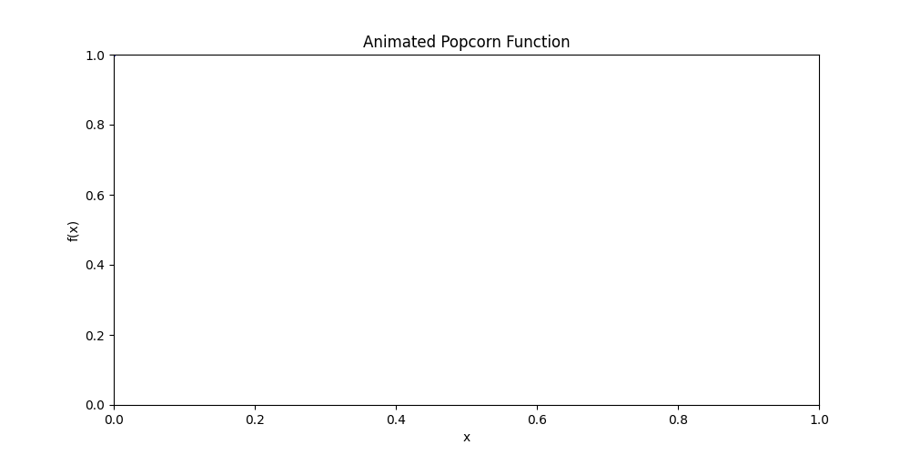

# Popcorn Analysis Fun

---

## Details
Define \( f : (0, 1) \rightarrow \mathbb{R} \) as

$$
f(x) := 
\begin{cases} 
\frac{1}{k} & \text{if } x = \frac{m}{k}, \text{ where } m, k \in \mathbb{N} \text{ and have no common divisors (lowest terms)}, \\
0 & \text{if } x \text{ is irrational}.
\end{cases}
$$

See the graph of \( f \) in the diagram above. We claim that \( f \) is continuous at all irrational \( c \) and discontinuous at all rational \( c \).

**Proof**:

1. **Discontinuity at Rational Points**:

    Let \( c = \frac{m}{k} \) be rational and in lowest terms. Take a sequence of irrational numbers \( \{ x_n \}_{n=1}^{\infty} \) such that \( \lim_{n \to \infty} x_n = c \). Then,

    $$
    \lim_{n \to \infty} f(x_n) = \lim_{n \to \infty} 0 = 0,
    $$

    but

    $$
    f(c) = \frac{1}{k} \neq 0.
    $$

    So, \( f \) is discontinuous at \( c \).

2. **Continuity at Irrational Points**:

    Let \( c \) be irrational, so \( f(c) = 0 \). Take a sequence \( \{ x_n \}_{n=1}^{\infty} \) in \( (0, 1) \) such that \( \lim_{n \to \infty} x_n = c \). Given \( \epsilon > 0 \), find \( K \in \mathbb{N} \) such that \( \frac{1}{K} < \epsilon \) by the **Archimedean property**.

    If \( \frac{m}{k} \in (0, 1) \) and \( m, k \in \mathbb{N} \), then \( 0 < m < k \). So there are only finitely many rational numbers in \( (0, 1) \) whose denominator \( k \) in lowest terms is less than \( K \).

    As \( \lim_{n \to \infty} x_n = c \), every number not equal to \( c \) can appear at most finitely many times in \( \{ x_n \}_{n=1}^{\infty} \).

    Hence, there is an \( M \) such that for \( n \geq M \), all the rational numbers \( x_n \) have denominators larger than or equal to \( K \). Thus, for \( n \geq M \),

    $$
    f(x_n) < \epsilon.
    $$

    Therefore, \( f \) is continuous at irrational \( c \).
